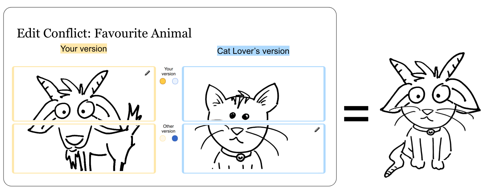
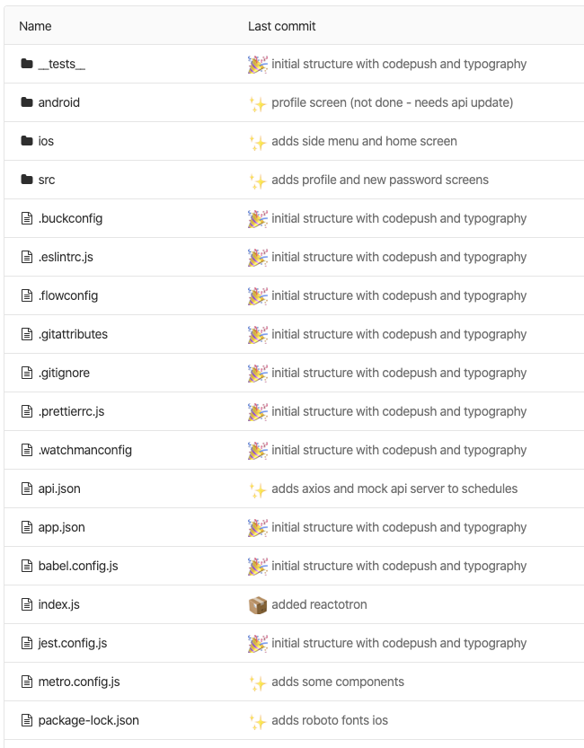
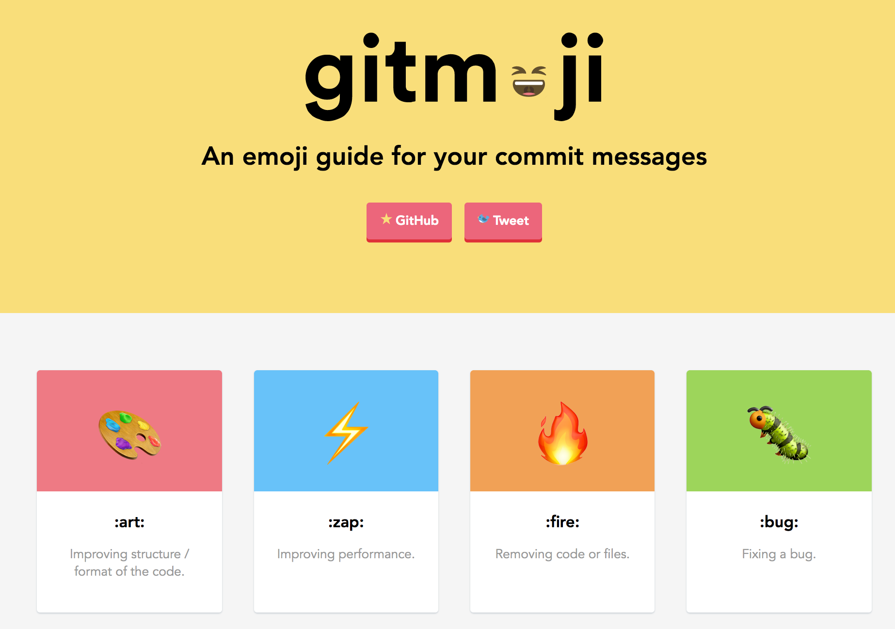

# Git

[1. Fluxo de trabalho](#fluxo-de-trabalho)

[2. Conflitos](#conflitos)

[3. Dicas](#dicas)

---

## Fluxo de trabalho

<a href="https://youtu.be/w3jLJU7DT5E" target="_blank">Vídeo GitHub :octocat:</a>
<small> Idioma: 🇺🇸 | Legenda: 🇧🇷</small>

<small>Fonte: <a href="https://codigomaromba.com/2019/01/02/git-gitflow-usar-ou-nao-usar/" target="_blank">Código Maromba</a> 🇧🇷</small>

---

## Conflitos

<small>Fonte: <a href="https://en.wikipedia.org/wiki/Edit_conflict" target="_blank">Wikipedia</a></small>

---

## Dicas

### Mensagem de commit

<small>Fonte: <a href="https://vidadeprogramador.com.br/" target="_blank">Vida de Programador 🇧🇷</a></small>

A padronização de mensagens de commit facilita o entendimento entre desenvolvedores.

Uma forma seria o formato do **Commit Amigão**:

- **feat** (nova funcionalidade para o usuário)
- **style** (formatação geral no código, como lint. Não confundir com CSS)
- **refactor** (refatoração de código de produção)
- **test** (adicionar/refatorar testes)
- **fix** (correção de bug para o usuário)
- **docs** (mudanças na documentação)
- **chore** (atualização de tarefas ou código que não está relacionado a código em produção)

<small>Fonte: <a href="https://github.com/BeeTech-global/bee-stylish/tree/master/commits" target="_blank">Guia do Commit Amigão</a> 🇧🇷</small>

### Emojis em commits

Exemplo de mensagens de commit contendo emoji:

<small>Fonte: <a href="https://medium.com/brainny-smart-solutions/padroniza%C3%A7%C3%A3o-de-commits-com-gitmoji-ef0af535f3a4" target="_blank">Medium</a> 🇧🇷</small>

Guia de emojis para cada tipo de commit:

<small>Fonte: <a href="https://gitmoji.dev/" target="_blank">Gitmoji</a> 🇺🇸</small>
